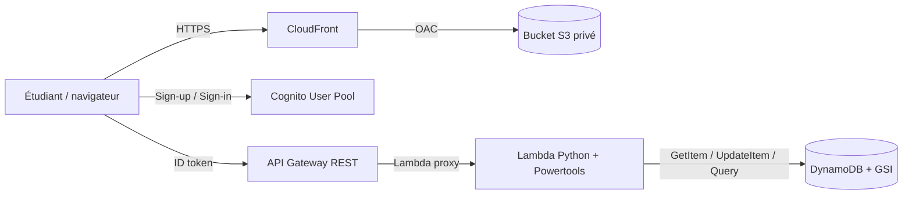

# Serverless Dino — AWS Student Builder Group Lab

## Et si déployer votre application web pouvait ne rien coûter ?

Ce projet propose un lab guidé d'environ **1 h 30** pour découvrir comment utiliser les services serverless d'AWS afin d'héberger une application complète : frontend statique, création de comptes, authentification, API, logique métier et base de données NoSQL. Aucun serveur n'est à provisionner ou à administrer et, pour une petite application éligible aux offres gratuites AWS, l'infrastructure peut fonctionner sans facture.

Cette architecture peut être hébergée **gratuitement tant qu'elle reste sous 1 million de requêtes par mois**, sous réserve que le compte soit éligible et que les autres quotas gratuits soient respectés. [AWS Lambda](https://aws.amazon.com/lambda/pricing/) inclut 1 million de requêtes gratuites par mois et [API Gateway](https://aws.amazon.com/api-gateway/pricing/) inclut 1 million d'appels REST par mois pendant 12 mois pour les nouveaux comptes éligibles. [Cognito](https://aws.amazon.com/cognito/pricing/) couvre jusqu'à 10 000 utilisateurs actifs mensuels, tandis que le [plan CloudFront Free](https://aws.amazon.com/cloudfront/pricing/) comprend 1 million de requêtes et 100 Go de transfert par mois.

Selon votre aisance avec la console et les options réalisées, comptez entre **1 h et 2 h**.

## Parcours

| Durée | Étape | Résultat |
|---:|---|---|
| 5 min | [Préparer le lab](docs/00-prerequis.md) | Sandbox et variables prêtes |
| 15 min | [1 — Héberger le site sur S3](docs/01-hebergement-s3.md) | Jeu public et jouable |
| 20 min | [2 — Ajouter Cognito](docs/02-authentification-cognito.md) | Inscription et connexion |
| 45 min | [3 — Construire le backend](docs/03-backend-serverless.md) | Scores personnels et top 10 |
| 20 min + propagation | [4 — Sécuriser avec CloudFront](docs/04-cloudfront-optionnel.md) | HTTPS et bucket privé, optionnel |
| 5 min avec reset / 10 min manuellement | [Nettoyer les ressources](docs/05-nettoyage.md) | Sandbox propre |

Ces durées correspondent à une exécution fluide en suivant les valeurs indiquées. Les explications détaillées peuvent être consultées au besoin ; le dépannage et les délais de propagation AWS peuvent rapprocher la durée totale de 2 h.

## Contenu du dépôt

- [`site/`](site/README.md) contient le jeu et `site/dist/`, directement uploadable dans S3.
- [`snippets/`](snippets/README.md) contient la Lambda, les politiques IAM/S3, le contrat OpenAPI et des exemples.
- [`docs/`](docs/) contient les énoncés et recevra directement les captures, avec un nom préfixé par étape.

Le déploiement du lab se fait dans la console AWS. Aucun outil d'Infrastructure as Code n'est requis.

## Architecture finale

> L'étape 1 utilise volontairement l'endpoint website S3 public et HTTP pour rendre visible le compromis de sécurité. L'étape CloudFront est la cible recommandée hors démonstration.
