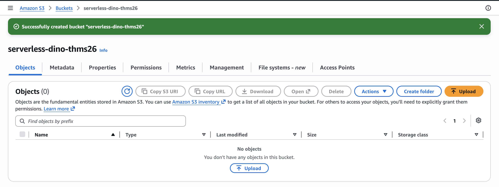
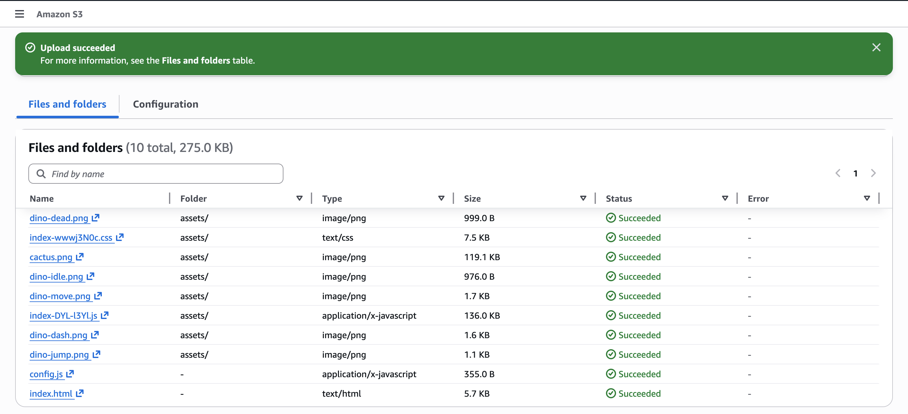
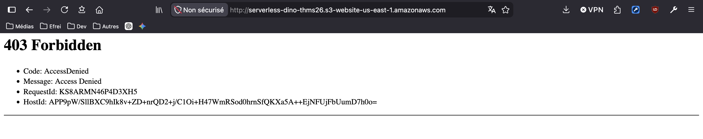
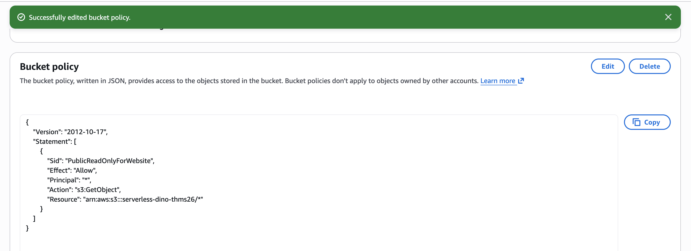
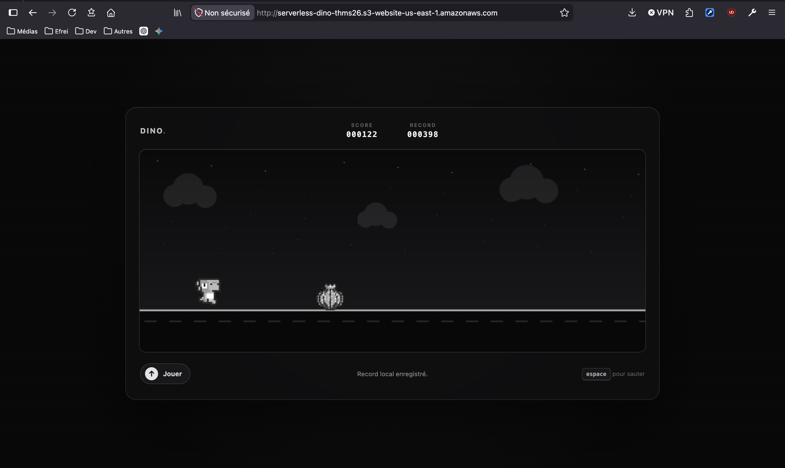

# Étape 1 — Héberger le jeu sur Amazon S3

**Durée : 15 minutes · Objectif : rendre le jeu accessible depuis Internet**

À cette étape, le jeu fonctionne seul. Les boutons de compte et de classement restent volontairement masqués tant que leur configuration manque. C'est attendu.

## 1. Créer le bucket

1. Ouvrez **Amazon S3** dans `us-east-1`.
2. Choisissez **Create bucket**.
3. Nommez-le `serverless-dino-<votre-suffixe>`. Le nom doit être unique dans tout AWS.
4. Conservez **Object Ownership: Bucket owner enforced**. Les ACL restent désactivées.
5. Conservez pour l'instant les quatre réglages **Block Public Access** activés.
6. Laissez le chiffrement par défaut et créez le bucket.



## 2. Uploader le site précompilé

1. Ouvrez le bucket, puis choisissez **Upload**.
2. Depuis le dossier local `site/dist/`, ajoutez `index.html`, `config.js` et le dossier `assets/`.
3. Vérifiez que `index.html` se trouve directement à la racine du bucket.
4. Choisissez **Upload**.

La structure S3 attendue est :

```text
serverless-dino-…/
├── index.html
├── config.js
└── assets/
    ├── cactus.png
    ├── dino-….png
    ├── index-….css
    └── index-….js
```




## 3. Activer l'endpoint website

1. Ouvrez l'onglet **Properties** du bucket.
2. Dans **Static website hosting**, choisissez **Edit** puis **Enable**.
3. Sélectionnez **Host a static website**.
4. Saisissez `index.html` comme **Index document**.
5. Enregistrez et copiez le **Bucket website endpoint** dans votre fiche de valeurs.

L'URL ressemble à :

```text
http://serverless-dino-…s3-website-us-east-1.amazonaws.com
```

Une erreur `403 AccessDenied` est normale tant que la lecture publique n'a pas été autorisée.



## 4. Autoriser uniquement la lecture des objets

L'endpoint website S3 ne peut pas utiliser un bucket privé. Nous allons ouvrir uniquement l'action nécessaire, `s3:GetObject`.

1. Dans **Permissions > Block public access**, choisissez **Edit**.
2. Laissez **Block public access to buckets and objects granted through new ACLs** activé.
3. Laissez **Block public access to buckets and objects granted through any ACLs** activé.
4. Désactivez uniquement les deux protections contre les politiques publiques :
   - **Block public access to buckets and objects granted through new public bucket or access point policies** ;
   - **Block public and cross-account access to buckets and objects through any public bucket or access point policies**.
5. Confirmez le changement.

Les ACL restent donc inutilisables. Seule une bucket policy explicite peut rendre les fichiers lisibles.

6. Dans **Bucket policy**, choisissez **Edit**.
7. Copiez [`snippets/policies/s3-public-read-policy.json`](../snippets/policies/s3-public-read-policy.json).
8. Remplacez `__BUCKET_NAME__` par le nom exact du bucket, puis enregistrez.

La politique n'accorde ni `s3:ListBucket`, ni `s3:PutObject`, ni `s3:DeleteObject`.



## 5. Tester le site

Ouvrez le **Bucket website endpoint** dans un nouvel onglet.

Résultat attendu :

- le jeu s'affiche et réagit à `Espace`, `↑` ou au bouton tactile ;
- le score local progresse ;
- les contrôles de compte et de classement ne sont pas encore visibles ;
- aucune erreur de configuration n'est affichée au joueur.

Testez aussi les limites :

- l'URL d'un objet connu, par exemple `/config.js`, est lisible ;
- vous ne disposez d'aucun formulaire d'upload public ;
- les ACL du bucket restent désactivées.



## Pourquoi cette configuration n'est-elle pas la cible finale ?

L'endpoint website S3 ne prend pas en charge HTTPS. Le bucket doit également accepter une politique de lecture publique. Cela convient pour observer le mécanisme d'hébergement statique, pas pour une application contenant des jetons de session.

À l'étape 4, CloudFront apportera HTTPS et deviendra le seul lecteur autorisé du bucket via OAC. AWS recommande de bloquer l'accès public S3 quand il n'est pas strictement nécessaire.

## Dépannage

| Symptôme | Vérification |
|---|---|
| `403 AccessDenied` | Bucket policy, nom du bucket et deux réglages de policy publique |
| Page XML au lieu du site | Utiliser le **website endpoint**, pas l'Object URL |
| CSS absent | Le dossier `assets/` doit être à la racine |
| Page blanche | Vérifier que `config.js` et les assets ont été uploadés avec leur nom exact |
| Impossible d'enregistrer la policy | Le Block Public Access du compte Academy peut être plus restrictif ; prévenir l'instructeur |

## Résumé

Au cours de cette étape :

- vous avez créé un bucket S3 avec les ACL désactivées et le chiffrement par défaut ;
- vous avez uploadé le site précompilé en conservant `index.html`, `config.js` et `assets/` à la racine attendue ;
- vous avez activé l'hébergement statique et rendu le jeu accessible avec le website endpoint S3 ;
- vous avez limité l'accès public à la seule action `s3:GetObject` grâce à une bucket policy explicite ;
- vous avez constaté les limites de cette première architecture : endpoint HTTP et bucket publiquement lisible.

L'application frontend est désormais en ligne et jouable, mais les fonctions de compte et de classement ne sont pas encore configurées.

Continuez avec [l'authentification Cognito](02-authentification-cognito.md).
