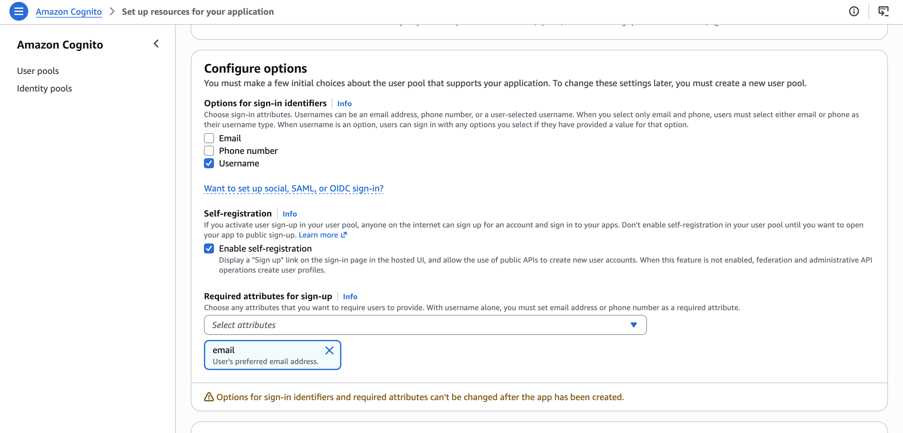
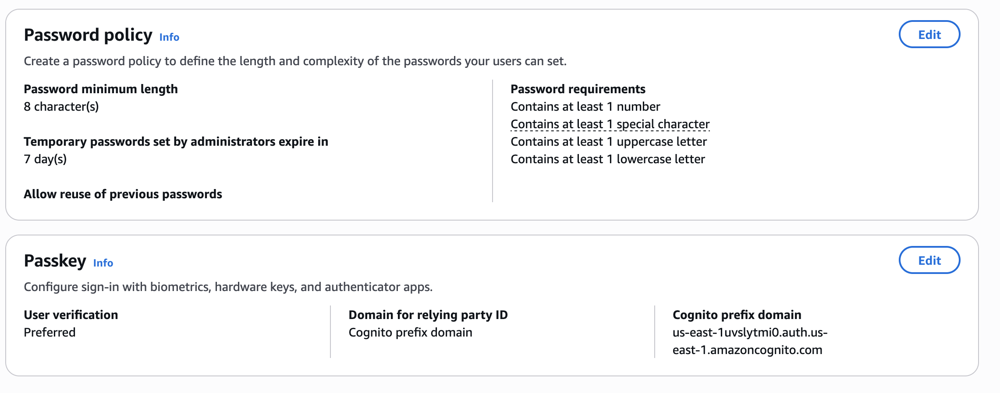
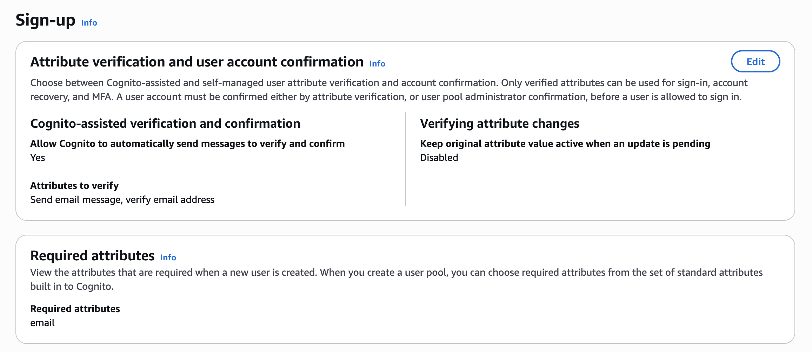
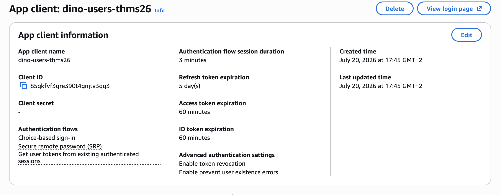
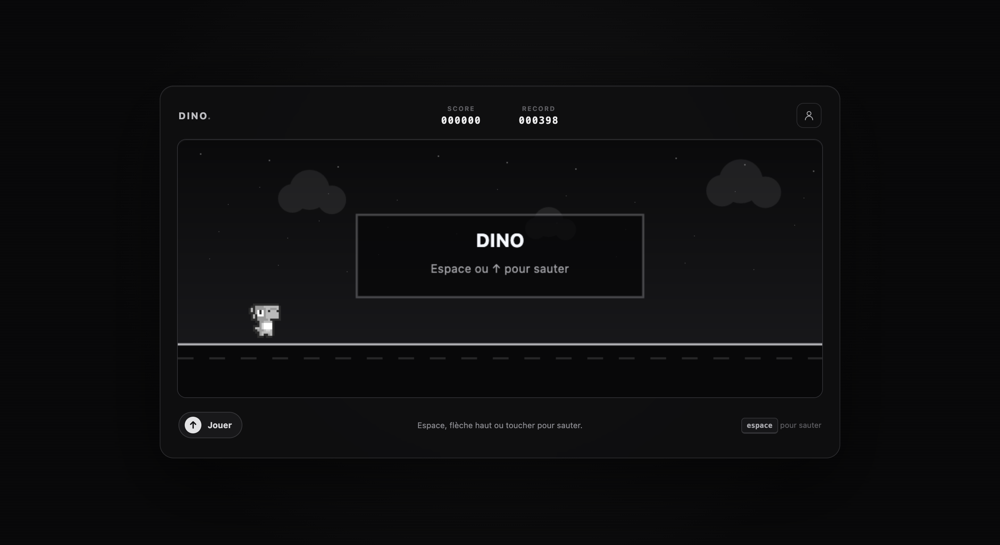
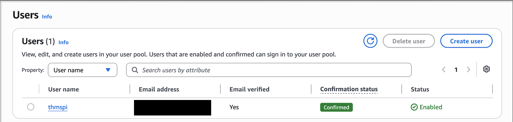
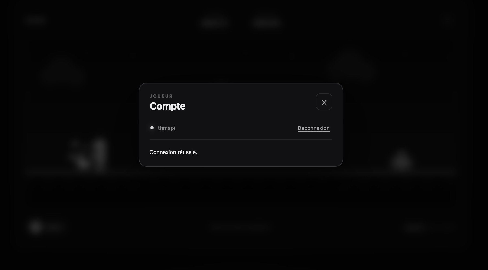

# Étape 2 — Ajouter l'authentification avec Amazon Cognito

**Durée : 20 minutes · Objectif : inscription, confirmation email et connexion**

Le navigateur utilisera directement un **User Pool** avec un client public. Nous ne créons pas d'Identity Pool : les joueurs ne reçoivent aucune permission IAM et n'appellent jamais DynamoDB eux-mêmes.

La console Cognito actuelle crée le User Pool et son premier App Client dans le même assistant. Certains réglages complémentaires ne sont donc visibles qu'après la création.

## 1. Définir l'application

1. Ouvrez **Amazon Cognito** dans `us-east-1`.
2. Dans **User pools**, choisissez **Create user pool**.
3. Dans **Define your application**, sélectionnez **Single-page application (SPA)**.
4. Dans **Name your application**, saisissez `dino-web-client-<suffixe>`.

Le type SPA est important : une application exécutée dans un navigateur est un **client public** et ne peut pas protéger un client secret.

## 2. Configurer les options irréversibles

Dans **Configure options**, utilisez exactement les valeurs suivantes :

| Zone | Valeur du lab |
|---|---|
| Options for sign-in identifiers | `Username` uniquement |
| Email | Non sélectionné comme identifiant de connexion |
| Phone number | Non sélectionné |
| Enable self-registration | Activé |
| Required attributes for sign-up | `email` |

Le username sera plus tard affiché dans le classement. Ne sélectionnez donc pas **Email** comme identifiant de connexion et demandez aux joueurs de choisir un pseudonyme public.

Ces choix, ainsi que les attributs obligatoires, ne peuvent pas être modifiés après la création du User Pool.



> **Sécurité.** L'auto-inscription est volontairement publique pour ce jeu. Toute personne connaissant le Client ID pourra demander la création d'un compte. Pour une application réelle, évaluez validation métier, protection adaptative, quotas et AWS WAF selon le niveau de risque.

## 3. Vérifier les méthodes d'authentification

Dans le User Pool, ouvrez **Authentication methods**.

### Politique de mot de passe

Choisissez une politique personnalisée adaptée au lab :

- minimum `8` caractères ;
- au moins une majuscule ;
- au moins une minuscule ;
- au moins un chiffre ;
- au moins un symbole.

### Multi-factor authentication

Conservez MFA sur **Preferred**. Aucun facteur MFA n'est demandé pendant le lab afin de tenir dans le temps imparti. Une application réelle doit prendre cette décision selon son analyse de risque.



## 4. Vérifier l'inscription, l'email et la récupération

Si vous êtes dans la page d'un App Client, revenez d'abord au **User Pool** avec le fil d'Ariane ou **Go to user pool**. Ces réglages appartiennent au pool et ne sont pas affichés dans la fiche de l'App Client.

Dans **Authentication > Sign-up**, contrôlez :

- **Self-service sign-up** activé ;
- confirmation du compte par un code envoyé par email ;
- attribut `email` vérifié automatiquement.

Dans **Authentication > Sign-in**, vérifiez que la récupération de compte utilise **verified email** en priorité. La console peut avoir sélectionné ce réglage automatiquement à partir de l'attribut email obligatoire.



## 5. Vérifier l'App Client généré

Dans **Applications > App clients**, ouvrez `dino-web-client-<suffixe>`.

La console actuelle affiche un résumé avec des libellés lisibles plutôt que les constantes techniques `ALLOW_*`. Vérifiez directement les lignes suivantes :

| Valeur visible dans la console | Signification | Attendu |
|---|---|---|
| Client secret : `-` | Client public, aucun secret embarqué dans le navigateur | Oui |
| Secure remote password (SRP) | Flow `ALLOW_USER_SRP_AUTH` utilisé par Amplify | Oui |
| Get user tokens from existing authenticated sessions | Flow `ALLOW_REFRESH_TOKEN_AUTH` | Oui |
| Enable prevent user existence errors | Réduit l'énumération des utilisateurs | Oui |
| Enable token revocation | Permet la révocation des refresh tokens | Recommandé |
| Choice-based sign-in | Flow moderne supplémentaire proposé par Cognito | Accepté, non utilisé par le jeu |

Si toutes ces lignes apparaissent comme sur la capture, **ne modifiez rien** : le client est déjà correctement configuré. Le bouton **Edit** n'est utile que si SRP, le renouvellement de session ou la prévention des erreurs d'existence sont absents.

Le code du jeu utilise SRP et n'envoie jamais le mot de passe à votre backend.

Le domaine et les pages Managed Login éventuellement créés par le nouvel assistant ne sont pas utilisés par ce lab. Le User Pool ID et le Client ID sont des identifiants publics ; ils ne doivent jamais être remplacés par un secret dans `config.js`.

Copiez dans votre fiche de valeurs :

- le **User pool ID** ;
- le **Client ID** de l'App Client.



## 6. Interpoler la configuration du site

Ouvrez localement `site/dist/config.js` et remplacez les trois premières valeurs :

```js
globalThis.DINO_CONFIG = Object.freeze({
  AWS_REGION: 'us-east-1',
  USER_POOL_ID: 'us-east-1_VOTRE_ID',
  USER_POOL_CLIENT_ID: 'VOTRE_CLIENT_ID',
  API_BASE_URL: '__API_BASE_URL__',
});
```

Ne modifiez pas encore `API_BASE_URL`.

Dans S3 :

1. sélectionnez l'ancien `config.js` ;
2. choisissez **Upload** puis ajoutez le nouveau fichier ;
3. confirmez l'écrasement ;
4. rechargez le site en ignorant le cache (`Ctrl/Cmd + Shift + R`).

Le bouton de compte doit apparaître dans l'en-tête discret du jeu.



## 7. Créer et confirmer un compte

1. Ouvrez le dialogue du compte depuis le jeu.
2. Dans **Inscription**, choisissez un username public. N'utilisez pas votre email comme username : il apparaîtra plus tard dans le classement.
3. Saisissez votre email et un mot de passe conforme à la politique.
4. Choisissez **Créer le compte**.
5. Consultez votre email, puis reportez le code dans l'onglet **Code**.
6. Revenez à **Connexion** et connectez-vous.

Résultat attendu : le dialogue du compte affiche le username connecté et permet la déconnexion. Le bouton de classement reste masqué car son API n'existe pas encore.

Les jetons Cognito sont stockés dans `sessionStorage` : ils sont supprimés lorsque la session de l'onglet est fermée. Le code ne journalise jamais leur contenu.





## Tests de sécurité rapides

- Ouvrez `config.js` depuis le navigateur : aucune donnée secrète ne doit s'y trouver.
- Vérifiez dans l'App Client qu'aucun client secret n'a été généré.
- Déconnectez-vous, puis vérifiez que l'interface revient en mode visiteur.
- Essayez de vous connecter avant confirmation avec un second compte : Cognito doit refuser.
- Vérifiez que l'email n'est jamais affiché dans le jeu.

## Dépannage

| Symptôme | Vérification |
|---|---|
| Bouton de compte absent après upload | Les trois identifiants de `config.js`, cache navigateur et version S3 |
| `User does not exist` | Username saisi, région et User Pool ID |
| `Incorrect username or password` | Mot de passe ou App Client incompatible avec SRP |
| `USER_SRP_AUTH is not enabled` | Activer `ALLOW_USER_SRP_AUTH` dans les authentication flows du client |
| Aucun email reçu | Adresse, spam, vérification email et quota Cognito de la sandbox |
| `InvalidParameterException` | Client public sans secret et attribut email autorisé en écriture |

## Résumé

Au cours de cette étape :

- vous avez créé un User Pool Cognito utilisant le `Username` comme identifiant public et l'email comme attribut obligatoire à vérifier ;
- vous avez activé l'auto-inscription et appliqué une politique de mot de passe adaptée au lab ;
- vous avez utilisé un App Client SPA public, sans client secret, compatible avec SRP et le renouvellement de session ;
- vous avez renseigné le User Pool ID et le Client ID dans `config.js`, puis redéployé ce fichier sur S3 ;
- vous avez créé, confirmé et connecté un compte directement depuis le jeu ;
- vous avez vérifié que l'email et les jetons restent privés, tandis que le username pourra être affiché dans le classement.

L'application sait désormais inscrire et authentifier ses utilisateurs sans leur attribuer de permissions IAM. Le backend de score reste à construire.

Continuez avec [le backend serverless](03-backend-serverless.md).
