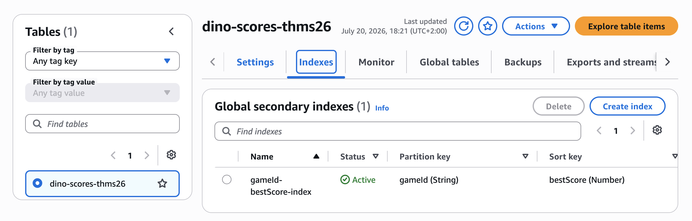
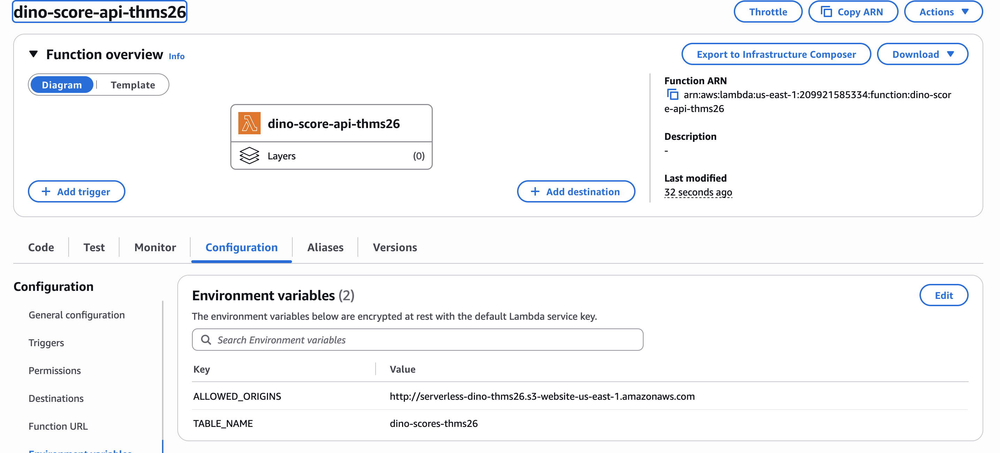
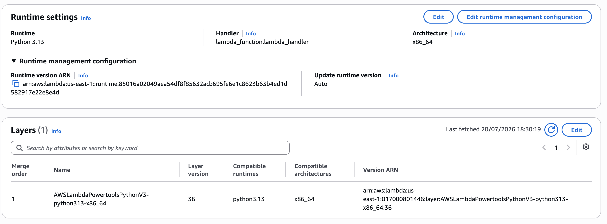
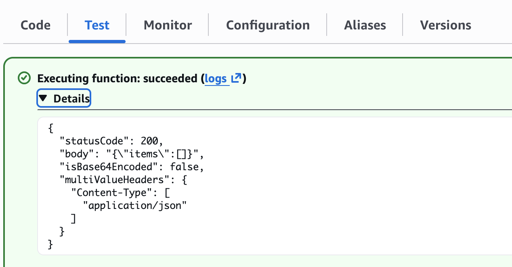
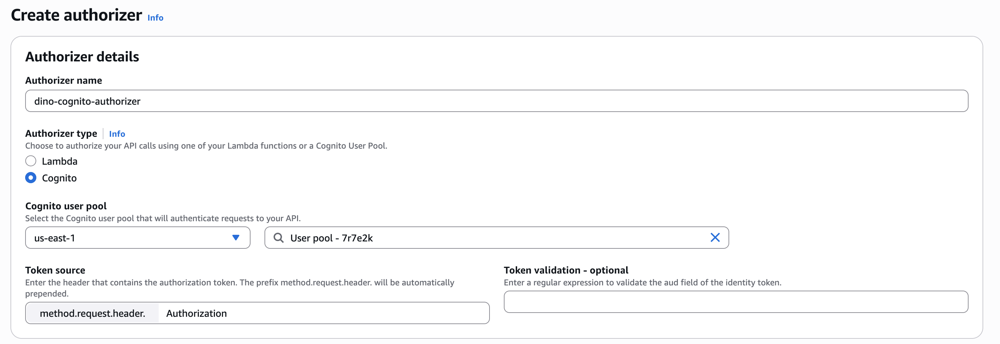
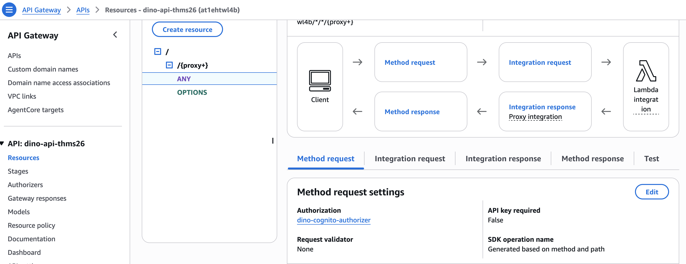
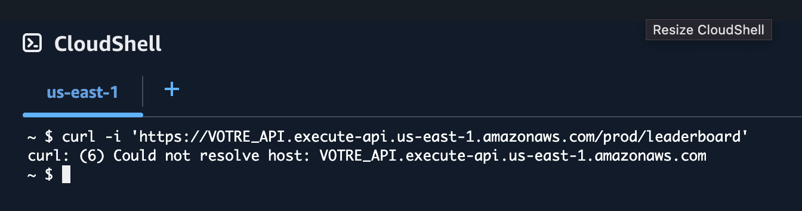
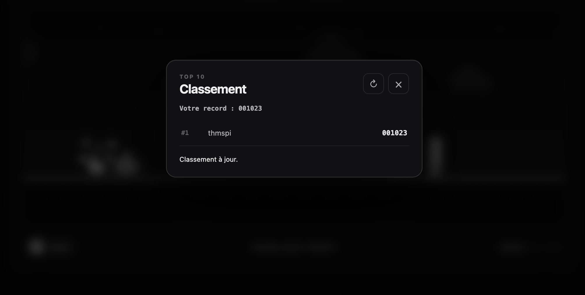
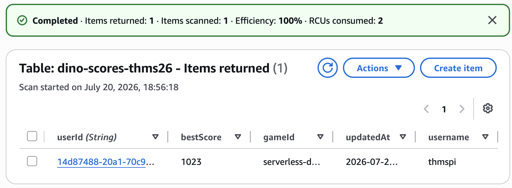
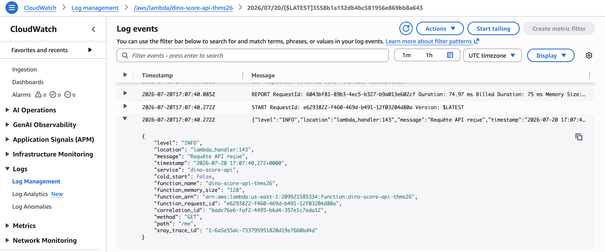

# Étape 3 — Construire le backend serverless

**Durée : 45 minutes · Objectif : API authentifiée, records personnels et top 10**

Le flux final de cette étape est :

```text
Navigateur -- ID token --> API Gateway -- événement proxy --> Lambda
                                                          |
                                                          +--> DynamoDB
```

API Gateway vérifie le JWT Cognito avant l'invocation. Lambda n'accepte jamais un `userId` fourni par le navigateur.

## Partie A — Modéliser les scores dans DynamoDB

### 1. Créer la table

1. Ouvrez **DynamoDB > Tables > Create table**.
2. Saisissez :
   - **Table name** : `dino-scores-<suffixe>` ;
   - **Partition key** : `userId`, type **String**.
3. Conservez **Default settings** et le mode de capacité **On-demand**.
4. Créez la table et attendez le statut **Active**.

Un joueur possède au maximum un item. Aucun item n'est créé à l'inscription : le premier score effectue un upsert.

### 2. Ajouter l'index du leaderboard

1. Ouvrez la table, puis **Indexes > Create index**.
2. Configurez :

| Champ | Valeur |
|---|---|
| Partition key | `gameId` — String |
| Sort key | `bestScore` — Number |
| Index name | `gameId-bestScore-index` |
| Attribute projections | Include `username` |

3. Créez l'index et attendez son statut **Active**.

Le GSI regroupe les scores sous `gameId=serverless-dino` et les trie numériquement. Une `Query` descendante avec `Limit=10` produit le top 10 sans lire toute la table.



## Partie B — Créer la Lambda Python/Powertools

### 1. Créer la fonction

1. Ouvrez **Lambda > Functions > Create function**.
2. Choisissez **Author from scratch**.
3. Utilisez :

| Réglage | Valeur |
|---|---|
| Function name | `dino-score-api-<suffixe>` |
| Runtime | Python 3.13 |
| Architecture | x86_64 |
| Execution role | Use an existing role |
| Existing role | `LabRole` |

4. Créez la fonction.

> **Exception AWS Academy.** `LabRole` rend le lab possible dans une sandbox où IAM est restreint. Dans un compte normal, créez un rôle dédié avec [`lambda-trust-policy.json`](../snippets/policies/lambda-trust-policy.json) et [`lambda-least-privilege-policy.json`](../snippets/policies/lambda-least-privilege-policy.json). Cette politique n'autorise que `GetItem`, `UpdateItem`, `Query` et les logs de cette fonction.

### 2. Configurer la fonction

Dans **Configuration > General configuration**, choisissez **Edit** :

- Memory : `128 MB` ;
- Timeout : `5 sec`.

Dans **Configuration > Environment variables**, ajoutez :

| Clé | Valeur |
|---|---|
| `TABLE_NAME` | nom exact de la table DynamoDB |
| `ALLOWED_ORIGINS` | origine S3 exacte, sans `/` final |

Une origine contient le schéma et le host, mais aucun chemin :

```text
http://serverless-dino-…s3-website-us-east-1.amazonaws.com
```

N'utilisez pas `*` : le resolver Powertools ne renverra CORS qu'à l'origine explicitement prévue.



### 3. Ajouter le layer AWS Lambda Powertools

Le numéro de version d'un layer évolue. Résolvez l'ARN courant au lieu de copier un numéro trouvé dans un ancien tutoriel.

1. Ouvrez **AWS CloudShell** dans `us-east-1`.
2. Exécutez :

```bash
aws ssm get-parameter \
  --name /aws/service/powertools/python/x86_64/python3.13/latest \
  --region us-east-1 \
  --query 'Parameter.Value' \
  --output text
```

3. Copiez l'ARN retourné.
4. Revenez dans Lambda, section **Layers > Add a layer**.
5. Choisissez **Specify an ARN**, collez l'ARN puis ajoutez le layer.

L'instructeur peut résoudre et communiquer cet ARN avant l'atelier si CloudShell est indisponible.



### 4. Ajouter le code

1. Dans l'onglet **Code**, ouvrez `lambda_function.py`.
2. Remplacez son contenu par [`snippets/lambda/lambda_function.py`](../snippets/lambda/lambda_function.py).
3. Choisissez **Deploy**.

Observez la structure :

- les décorateurs `@app.get` et `@app.put` déclarent les paths ;
- les routes appellent une fonction métier de haut niveau ;
- les `@app.exception_handler` construisent toutes les erreurs publiques ;
- `lambda_handler` délègue la résolution à Powertools ;
- validation, claims, écriture conditionnelle et requête GSI sont plus bas.

La condition DynamoDB est atomique :

```text
attribute_not_exists(bestScore) OR bestScore < :score
```

Deux requêtes concurrentes ne peuvent donc pas remplacer un record par un score inférieur.

### 5. Effectuer un test isolé

1. Dans Lambda, choisissez **Test > Create new event**.
2. Copiez [`snippets/lambda/events/get-leaderboard.json`](../snippets/lambda/events/get-leaderboard.json).
3. Remplacez `__S3_WEBSITE_HOST__` par le host de votre endpoint, sans `http://`.
4. Lancez le test.

Réponse attendue avant tout score :

```json
{
  "statusCode": 200,
  "body": "{\"items\":[]}",
  "isBase64Encoded": false
}
```

Si `aws_lambda_powertools` est introuvable, le layer est absent ou incompatible avec l'architecture/runtime.



## Partie C — Exposer la Lambda avec API Gateway

### 1. Créer la REST API et l'authorizer

1. Ouvrez **API Gateway > APIs > Build REST API**. N'utilisez pas **HTTP API** pour ce parcours.
2. Créez une nouvelle API régionale nommée `dino-api-<suffixe>`.
3. Ouvrez **Authorizers > Create authorizer**.
4. Configurez :
   - Name : `dino-cognito-authorizer` ;
   - Type : **Cognito** ;
   - Cognito user pool : votre pool `User pool - ...` ;
   - Token source : `Authorization`.
5. Créez l'authorizer.

Sans OAuth scopes configurés, l'authorizer Cognito de la REST API traite le jeton fourni comme un **ID token** et transmet ses claims à Lambda.



### 2. Créer la ressource proxy

1. Ouvrez **Resources** et sélectionnez `/`.
2. Choisissez **Create resource**.
3. Activez **Proxy resource**, ou saisissez :
   - Resource name : `{proxy+}` ;
   - Resource path : `/`.
4. Créez la ressource.

Sur `/{proxy+}`, créez une méthode **ANY** :

- Integration type : **Lambda function** ;
- Lambda proxy integration : activée ;
- Function : `dino-score-api-<suffixe>` ;
- Authorization : `dino-cognito-authorizer`.

Acceptez l'ajout de la permission permettant à API Gateway d'invoquer la fonction.

La méthode ANY est protégée. Powertools refusera ensuite les paths ou verbes non déclarés.

> [!WARNING]
> La ressource `/{proxy+}` et la méthode `ANY` sont utilisées ici pour simplifier le déploiement manuel et illustrer le routage déclaratif de Powertools. Dans un contexte de sécurité renforcée, évitez ce proxy générique : déclarez explicitement dans API Gateway uniquement les ressources et méthodes nécessaires, par exemple `GET /leaderboard`, `GET /me` et `PUT /me/score`. Cette approche réduit la surface exposée, empêche qu'une nouvelle route Lambda devienne accessible par inadvertance et facilite l'application d'un authorizer, du throttling et de règles de contrôle spécifiques à chaque opération.

### 3. Autoriser le preflight CORS sans JWT

Un navigateur envoie `OPTIONS` avant un `PUT` avec le header `Authorization`. Ce preflight ne possède pas de JWT et ne doit pas utiliser l'authorizer.

Sur la même ressource `/{proxy+}`, créez une méthode explicite **OPTIONS** :

- même Lambda et Lambda proxy integration ;
- Authorization : **NONE**.

La méthode explicite OPTIONS est prioritaire sur ANY. `APIGatewayRestResolver` produit automatiquement les headers CORS définis par `ALLOWED_ORIGINS`.



### 4. Configurer les erreurs Gateway et le throttling

Les erreurs produites avant Lambda, notamment un `401`, doivent rester lisibles par le navigateur.

1. Dans **Gateway responses**, ouvrez `DEFAULT_4XX`, puis `DEFAULT_5XX`.
2. Ajoutez le header :

```text
Access-Control-Allow-Origin : '*'
```

Le wildcard ne concerne ici que des erreurs génériques sans données privées. Les réponses métier réussies restent limitées aux origines configurées dans Lambda.

Après le premier déploiement, ouvrez le stage `prod` et définissez un throttling pédagogique :

- Rate : `5` requêtes/seconde ;
- Burst : `10` requêtes.

Ce plafond réduit les abus accidentels. Une protection Internet complète demanderait aussi une stratégie WAF et de quotas, hors périmètre du lab.

### 5. Déployer

1. Choisissez **Deploy API**.
2. Créez le stage `prod`.
3. Copiez l'**Invoke URL**, par exemple :

```text
https://abc123.execute-api.us-east-1.amazonaws.com/prod
```

4. Depuis CloudShell, vérifiez que l'API refuse une requête anonyme :

```bash
curl -i 'https://VOTRE_API.execute-api.us-east-1.amazonaws.com/prod/leaderboard'
```

Résultat attendu : `401 Unauthorized`. Une API qui retourne le classement sans jeton est mal configurée.



## Partie D — Connecter le site

1. Ouvrez `site/dist/config.js`.
2. Remplacez le dernier placeholder :

```js
API_BASE_URL: 'https://VOTRE_API.execute-api.us-east-1.amazonaws.com/prod',
```

3. Uploadez uniquement le nouveau `config.js` dans S3 et écrasez l'ancien.
4. Rechargez le site sans cache, puis reconnectez-vous si nécessaire.
5. Le bouton de classement apparaît dans l'en-tête du jeu ; ouvrez-le pour afficher le classement vide.
6. Lancez une partie et terminez-la : le score est envoyé automatiquement.
7. Réalisez une partie avec un score inférieur : le record cloud ne doit pas diminuer.

Ouvrez **DynamoDB > Explore table items**. L'item doit utiliser le `sub` Cognito comme `userId`, et non une valeur contrôlée par le navigateur.





## Observabilité

Dans **CloudWatch > Log groups**, ouvrez `/aws/lambda/dino-score-api-…`.

Powertools produit des logs JSON avec le nom du service, le request ID et le niveau. Le code désactive volontairement la journalisation de l'événement complet afin de ne pas copier le JWT dans CloudWatch.



## Dépannage

| Symptôme | Vérification |
|---|---|
| `401` même connecté | Authorizer sur ANY, bon User Pool, ID token dans Authorization |
| CORS dans la console navigateur | Origine exacte, sans `/`, OPTIONS sans authorizer, redéploiement API |
| `Internal server error` | Logs Lambda, `TABLE_NAME`, layer Powertools et droits de `LabRole` |
| `ResourceNotFoundException` | Table et Lambda dans la même région `us-east-1` |
| Classement en retard | Propagation éventuellement cohérente du GSI ; actualiser après quelques secondes |
| Score non remplacé | Le nouveau score doit être strictement supérieur |
| Route 404 | Path après `/prod` et ressource `{proxy+}` correctement créée |

## Résumé

Au cours de cette étape :

- vous avez créé une table DynamoDB et un GSI permettant de lire le top 10 sans effectuer de `Scan` ;
- vous avez déployé une Lambda Python structurée avec Powertools, des routes déclaratives, une validation stricte et une gestion d'erreurs commune ;
- vous avez utilisé `LabRole` dans AWS Academy et identifié, pour un compte AWS standard, la politique dédiée de moindre privilège limitée aux opérations DynamoDB et CloudWatch nécessaires ;
- vous avez exposé les routes avec une REST API Gateway protégée par un authorizer Cognito, tout en laissant les requêtes CORS `OPTIONS` accessibles sans JWT ;
- vous avez relié le frontend à l'API en renseignant `API_BASE_URL` dans `config.js` ;
- vous avez vérifié que seul un meilleur score remplace le record, que l'identité provient du claim Cognito `sub` et qu'aucun email, token ou JWT n'est stocké ou journalisé.

L'application est maintenant entièrement serverless : Cognito authentifie les joueurs, API Gateway protège l'API, Lambda exécute la logique métier et DynamoDB conserve les records et le classement.

Le cœur du lab est terminé. Passez au durcissement optionnel avec [CloudFront et un bucket privé](04-cloudfront-optionnel.md), ou directement au [nettoyage](05-nettoyage.md).
