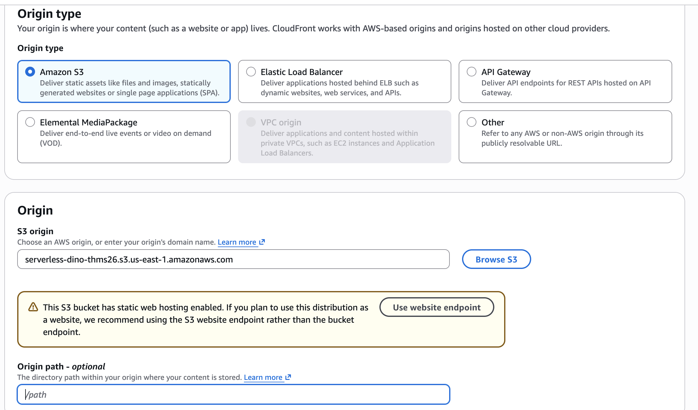

# Étape 4 — Servir le site avec CloudFront et un bucket privé

> **IMPORTANT** :
> Les environnements **AWS Academy Learner Lab ne permettent pas de créer une distribution CloudFront**. Dans cet environnement, ne tentez pas d'exécuter cette étape : lisez-la comme une extension optionnelle et conservez l'hébergement S3 réalisé précédemment. Pour la mettre en pratique, utilisez un compte AWS personnel compatible en surveillant les coûts et en supprimant les ressources à la fin du lab.

**Durée : 20 minutes + propagation · Option recommandée pour la sécurité**

Nous allons remplacer :

```text
Navigateur -- HTTP/public --> S3 website endpoint
```

par :

```text
Navigateur -- HTTPS --> CloudFront -- OAC signé --> S3 REST origin privé
```

Un endpoint website S3 est une **custom origin** pour CloudFront et ne peut pas utiliser Origin Access Control. Sélectionnez donc le bucket S3 lui-même comme origine, jamais son URL `s3-website-…`.

## 1. Créer la distribution

Ouvrez **CloudFront > Distributions > Create distribution**, puis suivez les écrans dans cet ordre.

### Pricing plan

Choisissez **Free plan — $0/month** pour ce lab, puis continuez.

### Distribution name

Dans **Distribution name**, saisissez :

```text
dino-site-<vos-initiales>
```

### Origin et OAC

1. Pour le type d'origine, choisissez **Amazon S3**.
2. Cliquez sur **Browse S3** et sélectionnez le bucket `serverless-dino-…`.
3. Sélectionnez le **bucket S3**, pas l'URL `s3-website-…` de l'hébergement statique.
4. Dans la partie **Origin access**, choisissez **Origin access control (recommended)**.
5. Choisissez **Create new OAC** si aucun OAC n'est encore proposé.
6. Conservez **Sign requests / Always** pour que CloudFront signe chaque requête envoyée à S3.

L'OAC permet à CloudFront de lire le bucket sans utilisateur IAM ni clé d'accès.




Conservez **Use recommended origin settings** ou **Use settings tailored for S3**, selon le texte affiché. C'est bien l'option à utiliser pour ce site statique. Ne choisissez pas **Customize origin settings**.


### Security

- Si vous avez sélectionné le **Free plan**, conservez les protections proposées. Ce plan inclut AWS WAF et nécessite une Web ACL associée.
- Si vous avez sélectionné **Pay as you go**, choisissez **Do not enable security protections** pour ne pas créer une Web ACL WAF facturée séparément.

Même sans WAF en mode pay-as-you-go, l'origine reste protégée par OAC, l'accès visiteur utilise HTTPS et l'API est protégée par l'authorizer Cognito.

## 2. Autoriser CloudFront, puis retirer le public

Ne fermez pas l'accès public avant que la policy OAC soit en place, sinon CloudFront recevra aussi `AccessDenied`.

1. Retournez dans **S3 > votre bucket > Permissions > Bucket policy**.
2. Vérifiez si CloudFront a déjà ajouté une déclaration autorisant le principal `cloudfront.amazonaws.com` avec une condition `AWS:SourceArn` limitée à votre distribution.
3. Si cette déclaration est absente, remplacez la politique publique par celle proposée par CloudFront, ou utilisez [`cloudfront-private-bucket-policy.json`](../snippets/policies/cloudfront-private-bucket-policy.json).
4. Si CloudFront a ajouté automatiquement la déclaration OAC, supprimez seulement l'ancienne déclaration publique dont le principal est `"*"`. Conservez la déclaration CloudFront.
5. Si vous utilisez le snippet, remplacez :
   - `__BUCKET_NAME__` ;
   - `__ACCOUNT_ID__` ;
   - `__DISTRIBUTION_ID__`.
6. Enregistrez.

Cette politique accorde `s3:GetObject` uniquement au service CloudFront lorsque l'appel provient de votre distribution précise.

7. Dans **Block public access**, choisissez **Edit** et activez les quatre protections.
8. Dans **Properties > Static website hosting**, désactivez l'hébergement website : CloudFront utilise l'origine REST.

Le bucket n'est désormais plus publiquement accessible.

## 3. Autoriser la nouvelle origine côté API

L'origine du navigateur est maintenant `https://d….cloudfront.net`.

1. Ouvrez la Lambda, puis **Configuration > Environment variables**.
2. Remplacez `ALLOWED_ORIGINS` par le domaine CloudFront, avec `https://` et sans `/` final :

```text
https://d123example.cloudfront.net
```

3. Enregistrez. Une nouvelle version de l'environnement Lambda sera utilisée automatiquement.

Pour une migration sans interruption, vous pouvez temporairement fournir les deux origines séparées par une virgule, puis retirer l'origine S3 après validation :

```text
http://ancien-site-s3…,https://d123example.cloudfront.net
```

Le fichier `config.js` ne change pas : Cognito et API Gateway restent dans `us-east-1` et l'URL API est déjà en HTTPS.

## 4. Tester et invalider le cache

1. Ouvrez `https://<distribution-domain-name>`.
2. Vérifiez le cadenas HTTPS.
3. Connectez-vous, chargez le classement et enregistrez un score.
4. Ouvrez l'ancien endpoint website S3 : il doit échouer après désactivation et retrait du public.

Si CloudFront affiche une ancienne version de `config.js` :

1. ouvrez la distribution, onglet **Invalidations** ;
2. créez une invalidation pour `/config.js`, ou `/*` si plusieurs fichiers ont changé ;
3. attendez le statut **Completed** puis rechargez.

## Ce que cette étape améliore

- chiffrement HTTPS entre le navigateur et CloudFront ;
- chiffrement HTTPS et requêtes signées entre CloudFront et l'origine S3 ;
- bucket privé avec Block Public Access ;
- cache edge et compression ;
- politique S3 limitée à une distribution précise.

CloudFront ne rend pas le jeu privé : tous les internautes peuvent charger les fichiers statiques. Cognito protège les fonctions de compte et API Gateway protège les données du leaderboard.

## Dépannage

| Symptôme | Vérification |
|---|---|
| CloudFront `403 AccessDenied` | Origine REST, OAC attaché, SourceArn et Account ID de la bucket policy |
| Racine `403`, mais `/index.html` fonctionne | Default root object = `index.html` |
| Jeu visible, API bloquée par CORS | `ALLOWED_ORIGINS=https://d….cloudfront.net` sans slash final |
| Ancien JavaScript | Créer une invalidation CloudFront |
| Bucket encore marqué public | Retirer l'ancienne policy et activer les quatre Block Public Access |
| Distribution interdite | Restriction du Learner Lab ; l'étape étant optionnelle, conserver l'architecture de l'étape 3 |

## Résumé

Si votre environnement permettait de réaliser cette étape :

- vous avez créé une distribution CloudFront utilisant les réglages de cache recommandés pour une origine S3 ;
- vous avez associé un OAC afin que les requêtes de CloudFront vers S3 soient signées ;
- vous avez retiré la lecture publique du bucket et réactivé les quatre protections Block Public Access ;
- vous avez défini `index.html` comme objet racine et servi le jeu avec HTTPS depuis le domaine CloudFront ;
- vous avez autorisé cette nouvelle origine dans la configuration CORS de la Lambda ;
- vous avez validé que l'ancien website endpoint S3 n'est plus accessible directement et que l'authentification comme le classement fonctionnent toujours.

Le frontend reste publiquement consultable, mais son bucket d'origine est désormais privé et ne peut être lu que par la distribution CloudFront autorisée.

Terminez par le [nettoyage des ressources](05-nettoyage.md).
